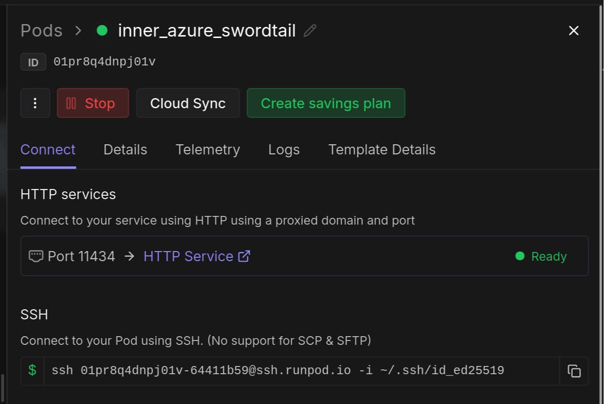

Good catch. Here's the corrected section with the image restored in the right place:

---

## Running Ollama on a runpod.io instance

RunPod provides on-demand GPU instances accessible via SSH. This guide assumes you have a RunPod account with at least $10 loaded (the minimum transaction).

### 1. Create the instance

Go to [https://console.runpod.io/hub?tabSelected=templates](https://console.runpod.io/hub?tabSelected=templates) and search for the `ollama/ollama:latest` template. Deploy an instance with an **NVIDIA A40** GPU — it is cost-effective and sufficient for 30B models via Ollama. Select a specific server region if available for better latency.

### 2. Connect

Once the instance is running, you should see the instance dashboard:



SSH into the machine using the connection command shown in the console (use the standard SSH command, not the TCP alternative):

```bash
ssh <your-runpod-ssh-command>
```

### 3. Pull and test a model

Once connected, pull your configured model and run a quick check:

```bash
ollama pull qwen3.6:27b   # or whichever model you configured
ollama run qwen3.6:27b "This is a test, just answer OK" --verbose
ollama pull bge-m3        # or any configured embedding model, if [embed].device = "ollama"
ollama run bge-m3 "Hello world"   # load it and test embeddings
```

### 4. Configure the Ollama host

In the RunPod console, locate the **HTTP Service** link for your instance (right-click → copy link). Add it to your `.env` file:

```
OLLAMA_HOST=<pasted-link>
```

The pipeline will use this URL to reach the Ollama API on your instance.

### 5. Verify connectivity

From a local terminal, confirm Ollama is reachable through the configured host:

```bash
curl $<pasted_link>/api/tags
```

---


## DEPRECATED - Running Ollama on a Thundercompute instance

Thundercompute provides pre-configured GPU instances optimised for Ollama. This is functionally equivalent to renting a server elsewhere with your own private OS, installing the dependencies by hand, and configuring port forwarding yourself. Thundercompute just removes that setup work. Their CLI (`tnr create` / `connect` / `status`) makes the process considerably easier, and this guide assumes you have it installed.

### 1. Create the instance

```bash
tnr create --mode prototyping --gpu a6000 --vcpus 4 --template ollama --primary-disk 100
```

### 2. Connect

Once the instance is running, open a second terminal and connect:

```bash
tnr connect 0
```

Leave this terminal open in the background for the rest of the setup.

### 3. Configure `~/.ssh/config`

`tnr connect 0` should already have updated (or created) a `tnr-0` host entry in `~/.ssh/config`, for example:

```
Host tnr-0
    HostName 216.81.200.239
    User ubuntu
    IdentityFile "/home/user/.thunder/keys/9u4bwkaz"
    IdentitiesOnly yes
    StrictHostKeyChecking no
    Port 30466
```

Duplicate that block under a new host name, then add the forwarding and keep-alive lines below the copied settings:

```
Host my-tnr-0
    # --- copied verbatim from tnr-0 (note the host name changes to my-tnr-0) ---
    HostName 216.81.200.239
    User ubuntu
    IdentityFile "/home/user/.thunder/keys/9u4bwkaz"
    IdentitiesOnly yes
    StrictHostKeyChecking no
    Port 30466
    # --- added below the copy ---
    # Forward the Ollama API port to localhost:
    LocalForward 11434 localhost:11434
    # Keep the tunnel alive across NAT idle and flaky Wi-Fi:
    ServerAliveInterval 30
    ServerAliveCountMax 3
    TCPKeepAlive yes
    # Fail fast on a dead forward or network:
    ExitOnForwardFailure yes
    ConnectTimeout 10
```

The Ollama host the pipeline connects to is set in `rag/config.toml` and defaults to `http://localhost:11434` (11434 is Ollama's default API port).

### 4. Start Ollama on the instance

In a new terminal, SSH in using the host you just defined and start the server:

```bash
ssh my-tnr-0
# you are now on the instance
OLLAMA_KEEP_ALIVE=24h OLLAMA_NUM_PARALLEL=8 start-ollama
```

Set `OLLAMA_NUM_PARALLEL` to at least `[match].score_parallelism` in `config.toml`. Both values must be matched to your instance's capacity (i.e., if you see timeout errors, lower them).

### 5. Pull and test a model

Back in the `tnr connect 0` terminal you left open, pull the model and run a quick check:

```bash
ollama pull qwen3.6:27b   # or whichever model you configured
ollama run qwen3.6:27b "This is a test, just answer OK" --verbose
ollama pull bge-m3 # or any configured embedding moddel, if [embed].device = "ollama"
ollama run bge-m3 "Hello world" # just load it and test the embeddings
```

Once the tests complete, the models are ready. You can close the `tnr connect` terminal, but **keep the SSH session open**, since it holds the port-forwarding tunnel.

### 6. Verify connectivity

From a local terminal, confirm Ollama is reachable through the forwarded port:

```bash
curl http://localhost:11434/api/tags
```